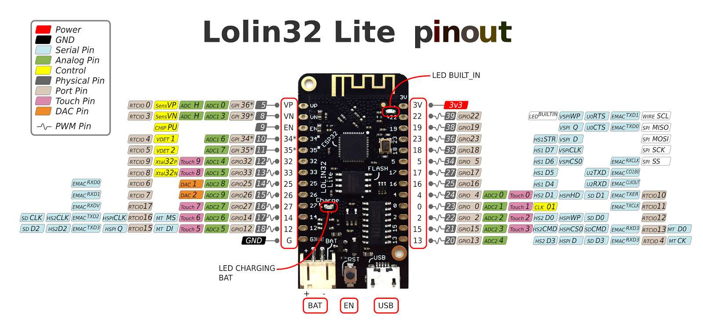
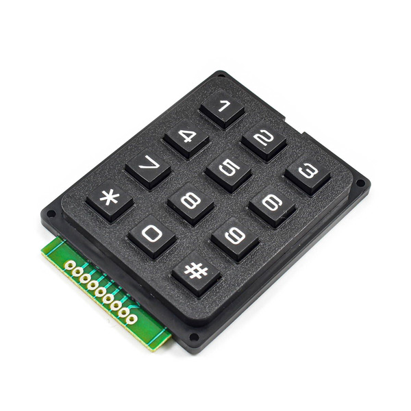
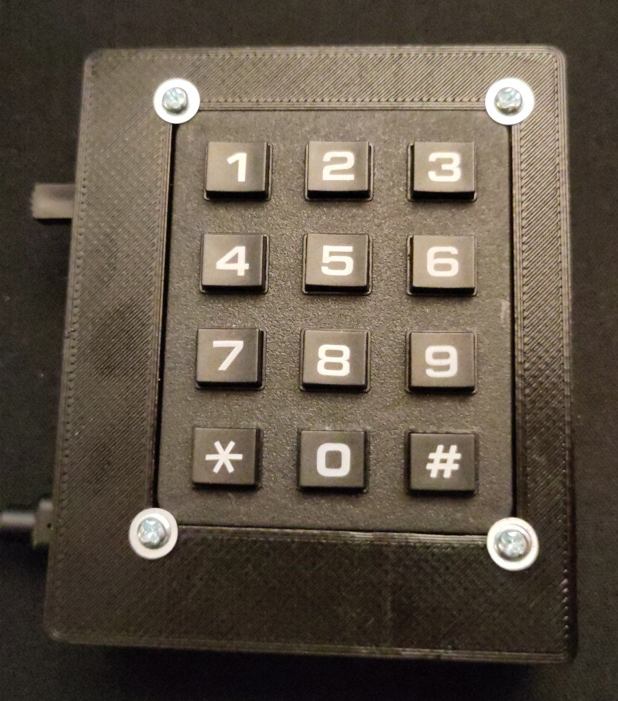
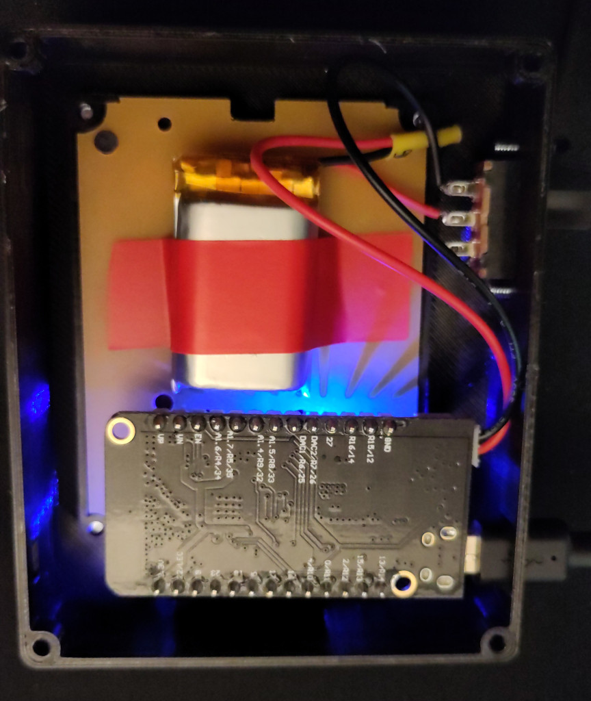

# GHS Initiative Input Pad

The GHS Initiative Input Pad is a small keypad connected to an ESP32 board to quickly input the initiative values for one character on [Gloomhaven Secretariat](https://github.com/lurkars/gloomhavensecretariat).

It is a [PlatformIO](https://docs.platformio.org) project.

## Hardware

The currently used hardware is

- a Lolin32 Lite Board (any ESP32 board should be fine)

    <a href="resources/lolin32-lite.jpg"></a>
- simple keypad

    <a href="resources/keypad.jpg"></a>
- 3.7V LiPo  (500mA for ~4-6h)
- simple slide switch (directly on battery power for turning devince on/off)
- a 3D-printed case
    [Case (OpenSCAD)](resources/case.scad)

    <a href="resources/device.jpg"></a>

    <a href="resources/device-inside.jpg"></a>


## Configuration

Before uploading the code, please copy [include/config-template.h](include/config-template.h) as `config.h` to the `include`-folder and adjust it to your needs. You must at least configure
```
#define GAME_CODE ""
#define WIFI_SSID ""
#define WIFI_PSWD ""
```
and check correct pins for keypad
```
#define ROW_PINS {16, 19, 23, 5}
#define COL_PINS {17, 4, 18}
```


## Usage

On first start, press any number from **1** to **9** to select the player. Afterwards enter your initiative with the number keys **0** - **9**, for example press **5** + **4** for an initiative of *54*. Use **0** + **0** to declare a long rest. To send the initiative to GHS, press the **#** key. If you're unsure of a type, press **\*** to reset the input. To reset the player number press **\*** 3x in a row.

A single LED indicates the current status:
- blinking in 1s interval: Enter the player number with the keypad
- LED not blinking: Enter Initiative
- LED blinking 500ms interval: Press **\*** again to reset player number
- LED blinking 100ms interval:
    - persistent: there is an error with server communication
    - for a duration of 3s: there was an error to set the initative, possible that:
        - the initiative is already the same value
        - the round has already started and you're not able to set the initative anymore

