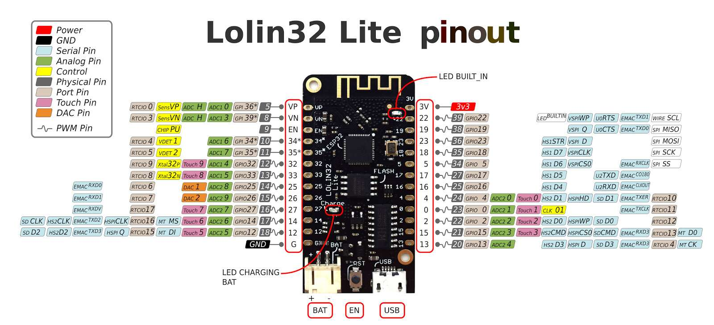
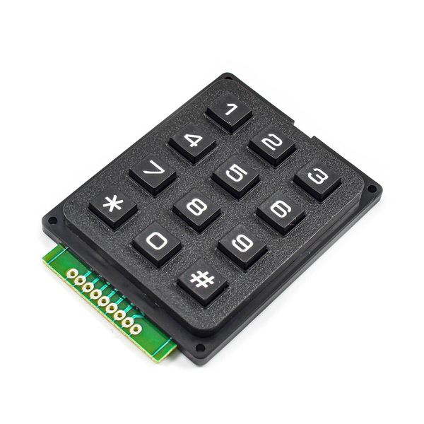
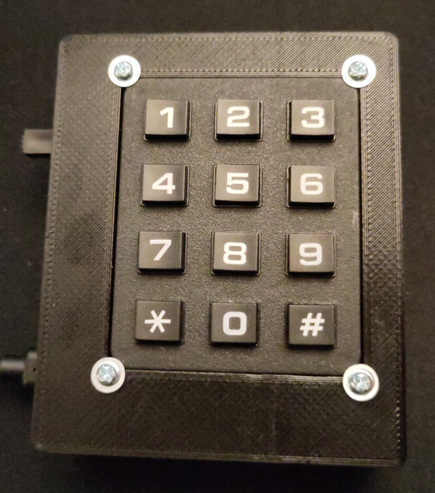
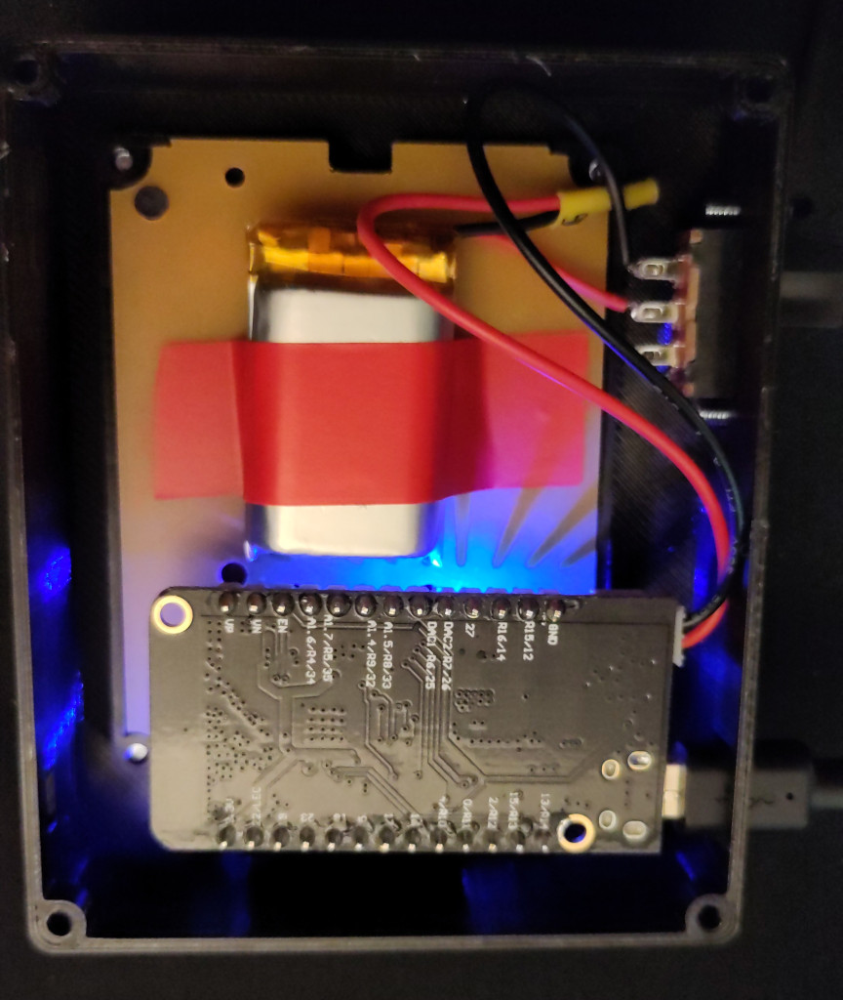

# GHS Initiative Input Pad

The GHS Initiative Input Pad is a small keypad connected to an ESP32 board to quickly input values for one character on [Gloomhaven Secretariat](https://github.com/lurkars/gloomhavensecretariat). With a standard 3-column keypad it handles initiative input. With a 4-column keypad four modes are available: initiative, hit points / experience / loot, conditions, and character identity.

It is a [PlatformIO](https://docs.platformio.org) project.

## Hardware

The currently used hardware is

- a Lolin32 Lite Board (any ESP32 board should be fine)

    <a href="resources/lolin32-lite.jpg"></a>
- simple keypad — **3-column** (4×3, classic layout) **or 4-column** (4×4, with an extra A/B/C/D column for extended input modes)

    <a href="resources/keypad.jpg"></a>
- 3.7V LiPo  (500mA for ~4-6h)
- simple slide switch (directly on battery power for turning devince on/off)
- a 3D-printed case
    [Case (OpenSCAD)](resources/case.scad)

    <a href="resources/device.jpg"></a>

    <a href="resources/device-inside.jpg"></a>


## Configuration

Before uploading the code, please copy [include/config-template.h](include/config-template.h) as `config.h` to the `include`-folder and adjust it to your needs. You must at least configure
```
#define GAME_CODE ""
#define WIFI_SSID ""
#define WIFI_PSWD ""
```
and check correct pins for keypad
```
#define ROW_PINS {16, 19, 23, 5}
#define COL_PINS {17, 4, 18}
```

For a **4-column keypad** additionally define
```
#define COLUMNS 4
#define ROW_PINS {5, 18, 23, 19}
#define COL_PINS {0, 4, 16, 17}
```
(adjust the fourth pin to your wiring).


## Usage

### 3-column keypad

On first start, press any number from **1** to **9** to select the player. Afterwards enter your initiative with the number keys **0** - **9**, for example press **5** + **4** for an initiative of *54*. Use **0** + **0** to declare a long rest. To send the initiative to GHS, press the **#** key. If you're unsure of a type, press **\*** to reset the input. To reset the player number press **\*** 3x in a row.

### 4-column keypad

The 4-column keypad (4×4 layout) adds a right-hand column of mode keys:

```
1  2  3  A
4  5  6  B
7  8  9  C
*  0  #  D
```

Press **A**, **B**, **C**, or **D** at any time to switch mode. The current input is reset when switching modes. Player selection and the **\*** / **#** behaviour are the same as for the 3-column keypad.

#### Mode A — Initiative (default)

Same as the 3-column keypad: enter initiative with **0**–**9**, **0**+**0** for a long rest, **#** to send.

#### Mode B — Hit Points / Experience / Loot

Each digit key picks the stat and the direction of change; press **#** to send the accumulated change.

| Key   | Action            |
|-------|-------------------|
| **1** | HP −1             |
| **2** | Reset HP change   |
| **3** | HP +1             |
| **4** | XP −1             |
| **5** | Reset XP change   |
| **6** | XP +1             |
| **7** | Loot −1           |
| **8** | Reset Loot change |
| **9** | Loot +1           |
| **0** | Draw a loot card  |
| **#** | Send              |

Only the last change within each category (HP, XP, Loot) is sent when pressing **#**. Pressing **0** sends a draw-loot-card command immediately on **#** regardless of the other values.

#### Mode C — Conditions

Enter the condition number and press **#** to toggle that condition on the character. Multi-digit values (**11**, **12**, …) are supported — digits accumulate as long as you keep pressing without submitting. After pressing **#**, the next key press starts a new condition number. **0** maps to condition 10.

#### Mode D — Identity

Press a digit key (**1**–**9**) to immediately switch the character to that identity slot — no **#** needed.

---

A single LED indicates the current status:
- blinking in 1s interval: Enter the player number with the keypad
- LED not blinking: Enter Initiative
- LED blinking 500ms interval: Press **\*** again to reset player number
- LED blinking 100ms interval:
    - persistent: there is an error with server communication
    - for a duration of 3s: there was an error to set the initative, possible that:
        - the initiative is already the same value
        - the round has already started and you're not able to set the initative anymore

